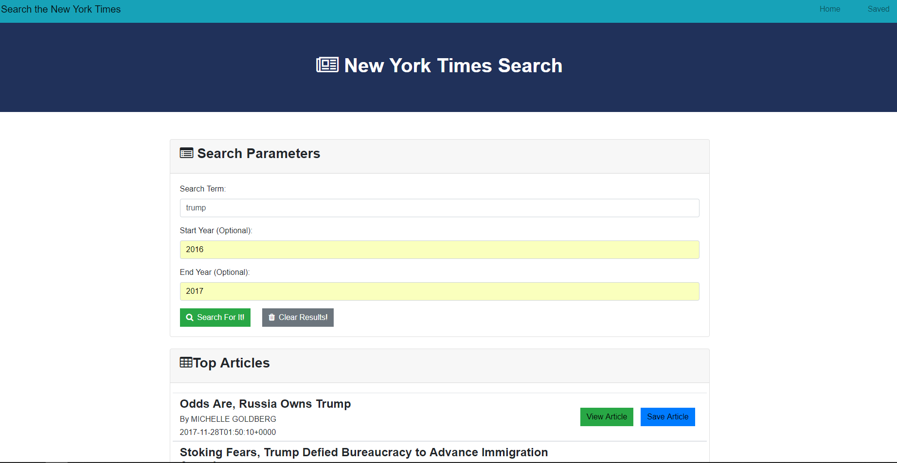

# Search the Times

## What the project does
This is an implementation of the New York Times Search app, built using a full Mongo-Express-React-Node stack, and completed as homework for the February 2018 UNC Coding Boot Camp. Here's a screen cap:

If you want, you can use it on [Heroku](https://nytsearch42.herokuapp.com/ ). Be aware that the app may be a little slow to load while Heroku spins up a virtual machine to host it. 

## How to get started with the app
To use the app, you must enter one or more words for which you would like to search the Time's coverage. If you like, you can limit the time frame covered by the search by entering a start year, an end year, or both. Click 'Search for It!' to kick the search off. 

As the screen cap shows, the app will show you the title, reporter's byline, and date of publication. If you want to read the article, click 'View Article'. If you find it interesting enough to want to save it, click 'Save Article'. When you're done with the results of a search, click 'Clear Results'. The app will clear the retrieved articles and the search fields, and you are ready to run another search. 

If you want to see the articles that you've saved, click the 'Saved' link in the upper right of the app window. A new page will load, displaying all the saved articles in the database. You can read the article by clicking the 'View Article' button. When you no longer want the saved article, click 'Delete Article'.

While the app is responsive to screen size, it looks best in a full-width browser window on a computer. You will probably need to scroll to see all the retrieved articles.

## Authors
This app is being built and will be maintained by Mark Hainline. Help should not be needed and will not be available.
